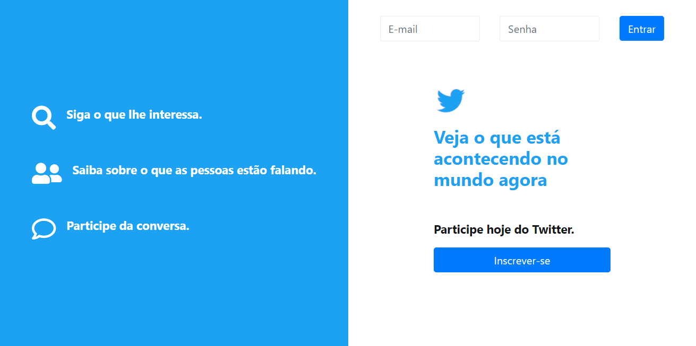
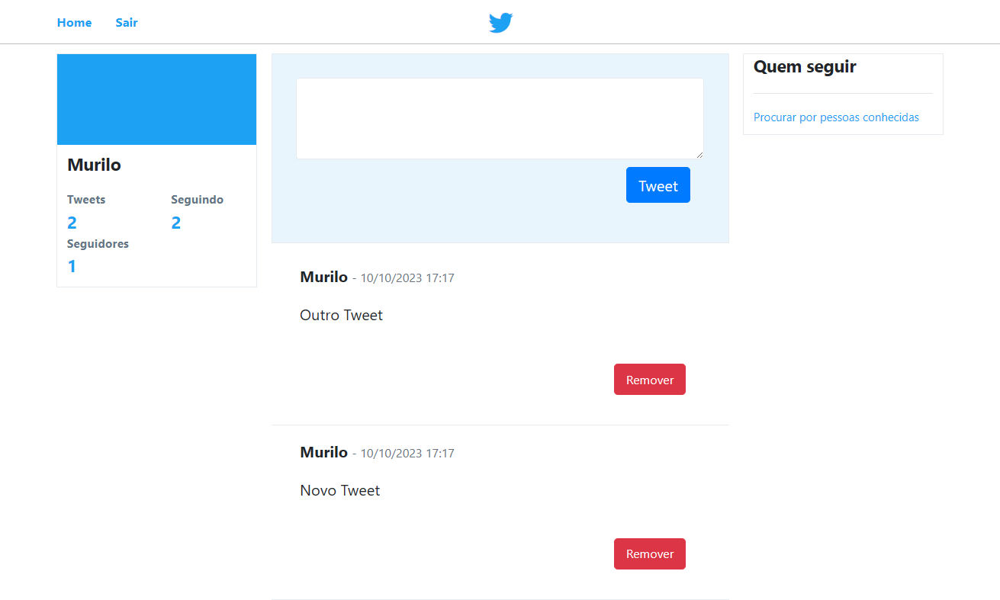
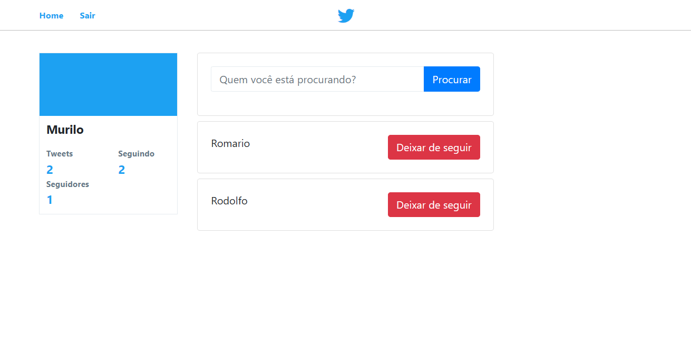

# Twitter Clone

## Descrição

Este é um clone simples do Twitter desenvolvido em PHP, utilizando a arquitetura MVC e um miniframework criado para facilitar o desenvolvimento da aplicação.

## Design





## Funcionalidades

- **Cadastro e Login:** Os usuários podem se cadastrar e fazer login na plataforma.
- **Twittar:** Os usuários podem publicar tweets para compartilhar com seus seguidores.
- **Seguir e Ser Seguido:** Os usuários podem seguir outros usuários e ver tweets apenas dos usuários que seguem.
- **Perfil do Usuário:** Cada usuário tem um perfil com informações básicas e uma lista de tweets.

## Requisitos do Sistema

- PHP 7.0 ou superior
- Servidor web (por exemplo, Apache)
- Banco de dados MySQL

## Instalação

1. Clone o repositório para o seu ambiente local.

```bash
git clone https://github.com/murilonicemento/twitter-clone.git
```

2. Importe o arquivo SQL fornecido em database/twitter_clone.sql para criar o banco de dados e tabelas necessárias.

3. Configure as credenciais do banco de dados no arquivo config/database.php.

4. Inicie o servidor web.

## Estrutura do Projeto

- **App**: Contém os controladores, modelos e visualizações seguindo a estrutura MVC.
- **public**: Arquivos públicos acessíveis pelo navegador (CSS e imagens).
- **vendor**: Pasta gerada pelo Composer para armazenar as dependências.

## Contribuição
Sinta-se à vontade para contribuir com melhorias, correções de bugs ou novas funcionalidades. Abra uma issue para discutir grandes mudanças antes de enviar um pull request.

## Licença
Este projeto é licenciado sob a Licença MIT - veja o arquivo [LICENSE](./LICENSE) para detalhes.
